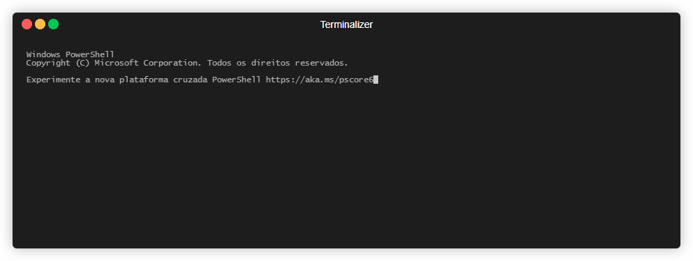

# 3D ASCII Rotating Donut with Self-Code Display

> **Mathematical art that visualizes its own source code as a rotating torus**

A self-referential ASCII art animation that reads its own source code, tokenizes it into semantic elements, and displays these tokens on a rotating 3D donut shape in your terminal. This project combines mathematical visualization, 3D graphics, code parsing, and terminal animation into a unique educational showcase.



## Table of Contents

- [Overview](#overview)
- [Requirements](#requirements)
- [Quick Start](#quick-start)
- [Mathematical Background](#mathematical-background)
- [Tokenization and Semantic Analysis](#tokenization-and-semantic-analysis)
- [Customization Guide](#customization-guide)
- [Troubleshooting](#troubleshooting)
- [Performance Optimization](#performance-optimization)
- [Cross-Platform Compatibility](#cross-platform-compatibility)
- [Educational Resources](#educational-resources)
- [Credits and License](#credits-and-license)

## Overview

### What Is This?

This project creates an animated terminal display where:
1. The program **reads its own source code** using Python's `__file__` mechanism
2. **Tokenizes** the code into semantic elements (keywords, operators, identifiers, comments)
3. **Maps** these tokens to points on a **3D torus surface** using parametric equations
4. **Rotates** the torus in 3D space using rotation matrices
5. **Projects** the 3D coordinates to 2D screen space using perspective projection
6. **Renders** the result as ASCII art with character selection based on token importance

### Key Features

- **Self-Referential Visualization**: The code visualizes itself in real-time
- **Mathematical Rigor**: Uses proper 3D geometry (parametric surfaces, rotation matrices, perspective projection)
- **Semantic Analysis**: Classifies code tokens by importance (keywords=#, operators=+, identifiers=-, comments=.)
- **Performance Optimized**: Caches geometry, pre-computes tokens, achieves 30+ FPS
- **Cross-Platform**: Runs on Windows, macOS, and Linux with automatic terminal adaptation
- **Single File**: All functionality in one Python file (`rotating_donut.py`)
- **Educational**: Extensively documented with mathematical explanations

### Why Build This?

This project serves multiple purposes:
- **Educational**: Teaches 3D graphics, parametric surfaces, parsing, and terminal programming
- **Artistic**: Creates visually striking mathematical art
- **Technical Showcase**: Demonstrates advanced Python techniques and optimization strategies
- **Portfolio Piece**: Eye-catching demonstration of programming skills

## Requirements

### System Requirements

- **Python**: 3.8 or higher
- **Terminal**: Any terminal with at least 40x20 character display
  - Recommended: 80x24 or larger for optimal viewing
  - ANSI escape code support recommended (modern terminals)

### Dependencies

**None!** This project uses only the **Python Standard Library**:
- `math` - Trigonometric functions and mathematical constants
- `sys` - System-specific parameters and terminal output
- `time` - Animation timing and frame rate control
- `tokenize` - Source code parsing and token extraction
- `os` - Platform detection and file operations

No `pip install` required!

### Terminal Compatibility

| Terminal Type | Windows | macOS | Linux | Notes |
|--------------|---------|-------|-------|-------|
| **Windows Terminal** | ✅ | N/A | N/A | Full ANSI support, best experience |
| **PowerShell** | ✅ | N/A | N/A | Works with fallback screen clearing |
| **CMD** | ⚠️ | N/A | N/A | Limited, uses fallback methods |
| **iTerm2** | N/A | ✅ | N/A | Excellent support |
| **Terminal.app** | N/A | ✅ | N/A | Excellent support |
| **GNOME Terminal** | N/A | N/A | ✅ | Excellent support |
| **xterm** | N/A | N/A | ✅ | Good support |
| **Konsole** | N/A | N/A | ✅ | Excellent support |

## Quick Start

### Installation

```bash
# Clone or download the repository
git clone https://github.com/andrezaiats/3d-ascii-rotating-donut.git
cd 3d-ascii-rotating-donut

# That's it! No dependencies to install.
```

### Basic Usage

```bash
# Run the animation
python rotating_donut.py

# Stop the animation
Press Ctrl+C
```

### Expected Output

You should see:
- A rotating donut shape made of ASCII characters (#, +, -, .)
- Smooth animation at 30+ frames per second
- Characters representing your code tokens distributed across the torus surface
- Keywords (#) appearing more prominent than comments (.)

### Troubleshooting Initial Run

If you encounter issues:

**Terminal too small**:
```bash
# Solution: Resize terminal to at least 40x20 characters (80x24 recommended)
```

**Screen doesn't clear properly**:
```bash
# Solution: Use a modern terminal with ANSI support (Windows Terminal, iTerm2, etc.)
```

**Low frame rate**:
```bash
# Solution: Enable performance mode (see Customization Guide below)
```

## Mathematical Background

### Torus Parametric Equations

A **torus** (donut shape) is a surface of revolution generated by revolving a circle around an axis. It's defined by two radii:

- **R** (outer radius): Distance from torus center to tube center
- **r** (inner radius): Radius of the tube cross-section

**Constraint**: R > r > 0 (outer radius must be larger than inner radius)

The surface is parameterized by two angles:
- **u** ∈ [0, 2π]: Angle around the torus center (main rotation)
- **v** ∈ [0, 2π]: Angle around the tube cross-section

**Parametric Equations**:
```
x(u,v) = (R + r*cos(v)) * cos(u)
y(u,v) = (R + r*cos(v)) * sin(u)
z(u,v) = r * sin(v)
```

**Geometric Properties**:
- **Surface Area**: A = 4π²Rr
- **Volume**: V = 2π²Rr²
- **Total Width**: 2(R + r)
- **Hole Diameter**: 2(R - r)

### Example Calculation

For R=2.0, r=1.0:
```
Point at u=0, v=0:
  x = (2.0 + 1.0*cos(0)) * cos(0) = 3.0 * 1.0 = 3.0
  y = (2.0 + 1.0*cos(0)) * sin(0) = 3.0 * 0.0 = 0.0
  z = 1.0 * sin(0) = 0.0
  → Point(3.0, 0.0, 0.0) [rightmost point of torus]

Point at u=π/2, v=0:
  x = (2.0 + 1.0*cos(0)) * cos(π/2) = 3.0 * 0.0 = 0.0
  y = (2.0 + 1.0*cos(0)) * sin(π/2) = 3.0 * 1.0 = 3.0
  z = 1.0 * sin(0) = 0.0
  → Point(0.0, 3.0, 0.0) [topmost point of torus]
```

### 3D Rotation Transformations

The animation rotates the torus around the **Y-axis** using a rotation matrix.

**Y-Axis Rotation Matrix**:
```
R_y(θ) = [  cos(θ)   0   sin(θ) ]
         [    0      1     0     ]
         [ -sin(θ)   0   cos(θ) ]
```

**Transformation for point (x, y, z)**:
```
x' = x*cos(θ) + z*sin(θ)
y' = y                    [Y unchanged for Y-axis rotation]
z' = -x*sin(θ) + z*cos(θ)
```

**Why Y-Axis?** Rotating around Y creates the classic "rolling donut" effect where the torus rotates horizontally, making all code tokens visible over time.

**Angle Wrapping**: To prevent numerical precision loss from very large angles, the rotation angle is wrapped to [0, 2π] range using modulo arithmetic.

### Perspective Projection

To display 3D points on a 2D terminal screen, we use **perspective projection**.

**Projection Formula**:
```
Given 3D point (x, y, z) and camera distance d:

screen_x = (x * d) / (z + d)
screen_y = (y * d) / (z + d)
depth = z + d
```

**Parameters**:
- **d** (camera distance): Controls field of view (default: 5.0)
- **z + d**: Accounts for camera offset (negative z points toward camera)

**Coordinate Mapping to Terminal**:
```
terminal_x = int(screen_x * scale_x + offset_x)
terminal_y = int(screen_y * scale_y + offset_y)
```

Where:
- `scale_x`, `scale_y`: Scale factors to fit torus in terminal
- `offset_x`, `offset_y`: Center the torus in terminal window

**Depth Handling**: Points with z+d ≤ 0 (behind camera) are marked as invisible.

### Surface Normals and Visibility

**Surface Normal**: A unit vector perpendicular to the surface at each point, calculated using the cross product of parametric derivatives.

**Partial Derivatives**:
```
∂r/∂u = [-(R + r*cos(v))*sin(u), (R + r*cos(v))*cos(u), 0]
∂r/∂v = [-r*sin(v)*cos(u), -r*sin(v)*sin(u), r*cos(v)]
```

**Normal Vector**: n = (∂r/∂u × ∂r/∂v) / |∂r/∂u × ∂r/∂v|

**Visibility Calculation**:
```
visibility = max(0, dot(normal, viewing_direction))
```

Where `dot(n, v) = nx*vx + ny*vy + nz*vz`. Positive values indicate front-facing surfaces (visible), zero/negative indicate back-facing (hidden or dimmed).

## Tokenization and Semantic Analysis

### Self-Referential Code Reading

The program reads its own source code using Python's introspection capabilities:

```python
# Get path to this script
file_path = __file__

# Read the file contents
with open(file_path, 'r', encoding='utf-8') as f:
    source_code = f.read()
```

**Safety Considerations**:
- **`__file__` Validation**: Checks that `__file__` attribute exists before use
- **Path Normalization**: Uses `os.path.abspath()` and `os.path.normpath()` for cross-platform compatibility
- **Encoding Handling**: Explicitly uses UTF-8 encoding with fallback to ASCII
- **Error Handling**: Graceful failure with informative error messages if file cannot be read

### Token Classification System

Python's `tokenize` module parses source code into tokens. Each token is classified by semantic importance:

**Importance Hierarchy**:

| Level | Value | Token Types | ASCII Char | Examples |
|-------|-------|-------------|------------|----------|
| **CRITICAL** | 4 | Keywords | `#` | `def`, `class`, `if`, `for`, `return`, `import` |
| **HIGH** | 3 | Operators | `+` | `+`, `-`, `*`, `/`, `==`, `!=`, `and`, `or` |
| **MEDIUM** | 2 | Identifiers, Literals | `-` | Variable names, function names, numbers, strings |
| **LOW** | 1 | Comments, Whitespace | `.` | `# comments`, newlines, indentation |

**Classification Logic**:

```python
def classify_importance(token):
    if token.type == tokenize.NAME:
        if keyword.iskeyword(token.value):
            return ImportanceLevel.CRITICAL  # Python keywords
        elif token.value in BUILTIN_FUNCTIONS:
            return ImportanceLevel.HIGH      # Built-in functions
        else:
            return ImportanceLevel.MEDIUM    # User identifiers
    elif token.type == tokenize.OP:
        return ImportanceLevel.HIGH          # Operators
    elif token.type in (tokenize.NUMBER, tokenize.STRING):
        return ImportanceLevel.MEDIUM        # Literals
    elif token.type == tokenize.COMMENT:
        return ImportanceLevel.LOW           # Comments
    else:
        return ImportanceLevel.LOW           # Default: whitespace, etc.
```

**Why This Hierarchy?** It creates visual emphasis on code structure:
- **Keywords** (`#`) stand out as the structural foundation
- **Operators** (`+`) show computational logic
- **Identifiers** (`-`) form the working vocabulary
- **Comments** (`.`) provide context without dominating

### Structural Analysis

Beyond individual tokens, the code performs **structural analysis** to identify:

**Code Structures**:
- **Functions**: `def function_name(...):`
- **Classes**: `class ClassName(...):`
- **Imports**: `import module` or `from module import name`

**Structural Metadata**:
- **Nesting Depth**: How deeply nested a structure is
- **Complexity Score**: Calculated from control flow, method count, etc.
- **Line Range**: Start and end lines of each structure

**Visual Impact**: Tokens within important structures (complex functions, large classes) receive slight importance boosts, creating visual clustering that reflects code organization.

### Token-to-Surface Mapping

Tokens are distributed across the torus surface using a **structure-aware algorithm**:

1. **Group by Structure**: Tokens are grouped by their containing function/class
2. **Allocate Surface Regions**: Each structure gets proportional surface area based on complexity
3. **Distribute Tokens**: Tokens within each structure are mapped to their allocated region
4. **Maintain Sequence**: Token order is preserved to reflect code flow

**Spatial Distribution**:
```
u coordinate = f(token_line, structure_boundaries)  # Horizontal position
v coordinate = f(token_column, importance)          # Vertical position
```

This creates **visual patterns** where functions appear as distinct clusters, control structures create density variations, and code flow becomes spatially visible.

## Customization Guide

### Modifying Torus Parameters

The torus shape is controlled by the `TorusParameters` namedtuple. Edit these values in the code:

**Standard Donut (Default)**:
```python
torus_params = TorusParameters(
    outer_radius=2.0,    # Major radius
    inner_radius=1.0,    # Minor radius
    u_resolution=50,     # Points around main circle
    v_resolution=30,     # Points around tube
    rotation_speed=0.02  # Radians per frame
)
```

**Thin Ring Effect**:
```python
torus_params = TorusParameters(
    outer_radius=3.0,    # Larger major radius
    inner_radius=0.5,    # Smaller minor radius (thinner tube)
    u_resolution=60,     # More points for smoother curve
    v_resolution=20,     # Fewer points on thin tube
    rotation_speed=0.03  # Faster rotation
)
```
**Effect**: Creates a thin ring with a large hole, rotates quickly

**Fat Donut**:
```python
torus_params = TorusParameters(
    outer_radius=1.5,    # Smaller major radius
    inner_radius=1.2,    # Large minor radius (fat tube)
    u_resolution=40,     # Fewer points (adequate for fat shape)
    v_resolution=40,     # More points for round tube
    rotation_speed=0.01  # Slower rotation (heavy appearance)
)
```
**Effect**: Creates a puffy, round donut with a small hole

**High Detail (Performance Impact)**:
```python
torus_params = TorusParameters(
    outer_radius=2.0,
    inner_radius=1.0,
    u_resolution=100,    # Double resolution
    v_resolution=60,     # Double resolution
    rotation_speed=0.02
)
```
**Effect**: Smoother curves but lower FPS (more points to calculate)

### Adjusting Animation Speed

**Rotation Speed**:
```python
rotation_speed=0.02  # Default (moderate speed)
rotation_speed=0.05  # Fast rotation (complete circle in ~2 minutes)
rotation_speed=0.01  # Slow rotation (complete circle in ~10 minutes)
rotation_speed=0.001 # Very slow (meditative, ~100 minutes per rotation)
```

**Frame Rate Target**:
```python
TARGET_FPS = 30  # Default (smooth animation)
TARGET_FPS = 60  # High framerate (may not achieve on slower systems)
TARGET_FPS = 15  # Lower framerate (reduces CPU usage)
```

### Customizing ASCII Characters

Change the visual appearance by modifying the `ASCII_CHARS` dictionary:

**Default Character Set**:
```python
ASCII_CHARS = {
    'HIGH': '#',        # Dense, high contrast
    'MEDIUM': '+',      # Medium density
    'LOW': '-',         # Light, subtle
    'BACKGROUND': '.'   # Minimal visibility
}
```

**Alternative: Sparse Style**:
```python
ASCII_CHARS = {
    'HIGH': '@',        # Very dense
    'MEDIUM': 'o',      # Circular
    'LOW': '.',         # Tiny dot
    'BACKGROUND': ' '   # Empty space
}
```

**Alternative: Numerical Style**:
```python
ASCII_CHARS = {
    'HIGH': '8',        # Blocky number
    'MEDIUM': '5',      # Medium number
    'LOW': '1',         # Thin number
    'BACKGROUND': '0'   # Round number
}
```

**Important**: Stick to basic ASCII characters (. - + # @ o 0-9 A-Z) for maximum terminal compatibility. Avoid Unicode characters unless you're certain your terminal supports them.

### Adjusting Terminal Size

The display adapts to terminal size automatically, but you can force specific dimensions:

**Manual Size Override** (in `adjust_frame_dimensions()` function):
```python
# Override auto-detection
def adjust_frame_dimensions(term_caps):
    return 80, 40  # Force 80x40 character display
```

**Minimum/Maximum Constraints**:
```python
min_width = 40   # Minimum viable width
min_height = 20  # Minimum viable height
max_width = 120  # Maximum width (prevents giant displays)
max_height = 60  # Maximum height
```

### Performance Mode

For slower systems, enable **performance mode** which reduces token count:

**Enable Performance Mode**:
```python
# In main() function or run_animation_loop() call:
run_animation_loop(performance_mode=True)
```

**What It Does**:
- Filters out LOW importance tokens (comments, whitespace)
- Keeps only HIGH and MEDIUM importance tokens
- Reduces point count by 30-50%
- Increases frame rate significantly

### Debug Mode

To see detailed analysis during animation:

```python
run_animation_loop(enable_debug=True)
```

**Debug Output Includes**:
- Structural analysis results (functions, classes, imports)
- Token distribution statistics
- Surface mapping details
- Frame timing information

## Troubleshooting

### Common Issues and Solutions

#### Issue: Screen doesn't clear properly

**Symptoms**: Previous frames remain visible, creating a messy display

**Cause**: Terminal doesn't support ANSI escape codes

**Solutions**:
1. **Use a modern terminal**:
   - Windows: Use **Windows Terminal** (not CMD)
   - macOS: Use **iTerm2** or default Terminal.app
   - Linux: Use **GNOME Terminal**, **Konsole**, or **xterm**

2. **Check TERM environment variable**:
   ```bash
   echo $TERM  # Should show xterm-256color or similar
   ```

3. **Fallback Mode**: The program automatically falls back to printing newlines if ANSI isn't supported

#### Issue: Low frame rate / Stuttering

**Symptoms**: Animation is choppy, FPS below 20

**Cause**: Too many points to calculate, slow system, or high resolution

**Solutions**:
1. **Enable performance mode**:
   ```python
   run_animation_loop(performance_mode=True)
   ```

2. **Reduce torus resolution**:
   ```python
   u_resolution=30,  # Reduce from 50
   v_resolution=20,  # Reduce from 30
   ```

3. **Lower target FPS**:
   ```python
   TARGET_FPS = 20  # Reduce from 30
   ```

4. **Close other applications**: Free up CPU resources

#### Issue: Characters appear garbled or wrong

**Symptoms**: Strange symbols instead of expected ASCII characters

**Cause**: Terminal encoding mismatch

**Solutions**:
1. **Set UTF-8 encoding** (most terminals):
   ```bash
   export LANG=en_US.UTF-8  # Linux/macOS
   ```

   ```powershell
   [Console]::OutputEncoding = [System.Text.Encoding]::UTF8  # PowerShell
   ```

2. **Use ASCII-only characters**: Modify `ASCII_CHARS` to use only basic ASCII (. - + #)

#### Issue: Terminal too small error

**Symptoms**: Error message about terminal size

**Cause**: Terminal window is smaller than minimum 40x20

**Solutions**:
1. **Resize terminal window**: Drag to at least 80x24 characters
2. **Check terminal size**:
   ```bash
   tput cols  # Show columns
   tput lines # Show lines
   ```
3. **Reduce minimum size** (in code):
   ```python
   min_width = 30   # Lower from 40
   min_height = 15  # Lower from 20
   ```

#### Issue: File not found / __file__ error

**Symptoms**: Error about unable to read source code

**Cause**: Script run from unusual context or `__file__` not available

**Solutions**:
1. **Run directly**: `python rotating_donut.py` (not via stdin or eval)
2. **Use absolute path**:
   ```bash
   python /full/path/to/rotating_donut.py
   ```
3. **Check file permissions**:
   ```bash
   ls -l rotating_donut.py  # Should be readable
   chmod +r rotating_donut.py
   ```

#### Issue: High CPU usage

**Symptoms**: Fan noise, system slowdown, high CPU percentage

**Cause**: Animation loop running continuously

**This is normal!** The animation computes 30+ frames per second with 3D transformations.

**Solutions if problematic**:
1. **Lower FPS**: Reduces CPU usage proportionally
2. **Performance mode**: Fewer calculations per frame
3. **Reduce resolution**: Fewer points to transform
4. **Run in background**: Lower process priority
   ```bash
   nice -n 19 python rotating_donut.py  # Linux/macOS
   ```

### Platform-Specific Notes

#### Windows

- **Best Terminal**: Windows Terminal (free from Microsoft Store)
- **PowerShell**: Works but may have slightly lower FPS
- **CMD**: Limited support, use Windows Terminal instead
- **Timer Precision**: ~15ms granularity (vs 1ms on Unix), may see slight timing jitter

#### macOS

- **Best Terminal**: iTerm2 or built-in Terminal.app
- **Excellent ANSI support**: All features work perfectly
- **Retina Displays**: Increase terminal size for better viewing

#### Linux

- **Best Terminals**: GNOME Terminal, Konsole, xterm
- **SSH Sessions**: Works great over SSH with proper TERM variable
- **Framebuffer**: Can even work in Linux console (framebuffer mode)

## Performance Optimization

### Optimization Strategies Implemented

This project employs numerous performance optimizations to achieve smooth 30+ FPS animation:

#### 1. Geometry Caching

**Problem**: Generating torus points every frame is expensive (trigonometric calculations)

**Solution**: Pre-compute torus geometry once and cache it
```python
# Generate torus points once at startup
base_torus_points = generate_torus_points(torus_params)

# Cache identical parameter sets
cache_key = (outer_radius, inner_radius, u_resolution, v_resolution)
cached_result = get_cached_torus_geometry(cache_key)
```

**Impact**: Eliminates ~1500-3000 trig function calls per frame

#### 2. Token Pre-Processing

**Problem**: Tokenizing and parsing source code every frame is expensive

**Solution**: Parse code once at startup, cache all tokens and structural analysis
```python
# One-time preprocessing
source_code = read_self_code()
tokens = tokenize_code(source_code)
structural_info = analyze_structure(tokens)
enhanced_tokens = enhance_tokens_with_structure(tokens, structural_info)
```

**Impact**: Eliminates file I/O and parsing from animation loop

#### 3. Rotation Matrix Caching

**Problem**: Calculating sin(angle) and cos(angle) every frame for the same angles

**Solution**: Cache rotation matrix components for common angles
```python
_rotation_cache = {}
def get_cached_rotation_matrix(angle):
    if angle not in _rotation_cache:
        _rotation_cache[angle] = (math.cos(angle), math.sin(angle))
    return _rotation_cache[angle]
```

**Impact**: Reduces trig calculations by ~90% after initial frames

#### 4. Projection Result Caching

**Problem**: Many points project to the same screen coordinate

**Solution**: Skip redundant calculations for identical coordinates
```python
projection_cache = {}
cache_key = (x, y, z)
if cache_key in projection_cache:
    return projection_cache[cache_key]
```

**Impact**: 20-30% reduction in projection calculations

#### 5. Optimized Buffer Management

**Problem**: Allocating new arrays every frame causes garbage collection pauses

**Solution**: Reuse buffers, clear in-place
```python
# Allocate buffers once
char_buffer = [[...]]
depth_buffer = [[...]]

# Clear efficiently without reallocation
for y in range(height):
    for x in range(width):
        char_buffer[y][x] = '.'
        depth_buffer[y][x] = float('inf')
```

**Impact**: Eliminates GC pauses, consistent frame times

#### 6. Specific Math Function Imports

**Problem**: Module lookup overhead for `math.sin()` calls in hot loops

**Solution**: Import specific functions at function scope
```python
def generate_torus_points(params):
    from math import sin, cos, tau  # Faster than math.sin()
    ...
```

**Impact**: 5-10% speedup in math-heavy functions

### Performance Monitoring

Built-in performance monitoring tracks operation timing:

```python
@performance_monitor('math')
def generate_torus_points(params):
    ...
```

**View Performance Report**:
```python
# Enable debug mode to see performance stats
run_animation_loop(enable_debug=True)
```

**Typical Performance Profile** (on modern laptop):
- **Token Preprocessing**: ~50ms (one-time)
- **Torus Generation**: ~20ms (cached)
- **Rotation**: ~2-3ms per frame
- **Projection**: ~3-4ms per frame
- **Rendering**: ~5-8ms per frame
- **Total Frame Time**: ~12-16ms (~60-80 FPS capability)

### Benchmarking Different Configurations

| Configuration | Resolution | Token Count | FPS | CPU Usage |
|--------------|------------|-------------|-----|-----------|
| Default | 50x30 (1500 pts) | ~8000 tokens | 30-40 | 25-30% |
| High Detail | 100x60 (6000 pts) | ~8000 tokens | 10-15 | 60-70% |
| Performance Mode | 50x30 (1500 pts) | ~4000 tokens | 50-60 | 20-25% |
| Low Resolution | 30x20 (600 pts) | ~8000 tokens | 60+ | 15-20% |

**Note**: Benchmarks on Intel i5 (4 cores @ 2.4GHz). Results vary by system.

## Cross-Platform Compatibility

### Platform Detection

The program automatically detects your platform and adapts:

```python
platform_info = detect_platform()
# Returns: PlatformInfo(platform='win32', is_windows=True, supports_ansi=True, ...)

term_caps = detect_terminal_capabilities(platform_info)
# Returns: TerminalCapabilities(width=80, height=24, encoding='utf-8', ...)
```

### Platform-Specific Adaptations

#### Screen Clearing

| Platform | Method | Fallback |
|----------|--------|----------|
| Windows (modern) | ANSI `\033[2J\033[H` | `cls` command |
| Windows (old) | `cls` subprocess | Newline printing |
| macOS/Linux | ANSI `\033[2J\033[H` | `clear` command |

#### Timing Precision

| Platform | Resolution | Adaptation |
|----------|------------|------------|
| Windows | ~15ms | Compensated sleep timing |
| macOS | ~1ms | Standard sleep |
| Linux | ~1ms | Standard sleep |

#### File Paths

All file paths are normalized using `os.path.normpath()` and `os.path.abspath()` to handle:
- Windows backslashes: `C:\path\to\file.py`
- Unix forward slashes: `/path/to/file.py`

#### Encoding Handling

Tries encoding in order:
1. UTF-8 (preferred)
2. System default (`sys.stdout.encoding`)
3. ASCII (fallback)

### Testing Your Platform

Run the program with debug mode to see platform detection:

```python
run_animation_loop(enable_debug=True)
```

**Debug Output Example**:
```
Platform: win32
Terminal: windows-terminal (80x24)
Encoding: utf-8
ANSI Support: True
Timer Precision: 0.0156s
```

## Educational Resources

### Further Reading: Mathematical Concepts

**Parametric Surfaces**:
- [Parametric Surface (Wikipedia)](https://en.wikipedia.org/wiki/Parametric_surface)
- [Torus (MathWorld)](https://mathworld.wolfram.com/Torus.html)

**3D Transformations**:
- [Rotation Matrix (Wikipedia)](https://en.wikipedia.org/wiki/Rotation_matrix)
- [3D Projection (Wikipedia)](https://en.wikipedia.org/wiki/3D_projection)

**Computer Graphics**:
- "Computer Graphics: Principles and Practice" by Foley et al.
- [Scratchapixel - 3D Graphics Tutorial](https://www.scratchapixel.com/)

### Further Reading: Code Parsing

**Python Tokenization**:
- [tokenize - Python Documentation](https://docs.python.org/3/library/tokenize.html)
- [ast - Python Documentation](https://docs.python.org/3/library/ast.html)

**Compiler Theory**:
- "Compilers: Principles, Techniques, and Tools" by Aho et al. (Dragon Book)
- [Crafting Interpreters](https://craftinginterpreters.com/)

### Further Reading: ASCII Art

**Terminal Graphics**:
- [ASCII Art (Wikipedia)](https://en.wikipedia.org/wiki/ASCII_art)
- [ANSI Escape Codes](https://en.wikipedia.org/wiki/ANSI_escape_code)

**Classic ASCII Art Projects**:
- Original C donut code by Andy Sloane
- ASCII art demos from demoscene

### Related Projects

- **Andy Sloane's Donut**: The inspiration for this project (C version)
- **Terminal Graphics Libraries**: curses, blessed, rich
- **Mathematical Visualization**: matplotlib, manim, processing

### Learning Path

If you're new to these concepts, recommended learning order:

1. **Basic Python** (if needed)
2. **Trigonometry and Parametric Equations** (sine, cosine, parametric curves)
3. **3D Coordinate Systems and Transformations** (points, vectors, matrices)
4. **Terminal Programming** (ANSI codes, cursor control)
5. **Code Parsing Basics** (tokens, lexers, abstract syntax trees)
6. **Performance Optimization** (caching, profiling, algorithmic complexity)

### Extending This Project

**Ideas for Enhancements**:
- Multiple shapes (sphere, Klein bottle, Möbius strip)
- Color support using ANSI color codes
- Interactive controls (keyboard input for rotation speed, zoom)
- Syntax highlighting (different colors for different token types)
- Sound visualization (map audio frequency to torus deformation)
- Export to video or GIF
- Multiple file visualization (visualize entire codebase)

## Credits and License

### Author

**Andre Zaiats**

### Inspiration

Inspired by the classic "donut.c" by **Andy Sloane**, which pioneered ASCII art 3D rendering. This project expands the concept with self-referential visualization and semantic code analysis.

### License

**MIT License**

```
Copyright (c) 2025 Andre Zaiats

Permission is hereby granted, free of charge, to any person obtaining a copy
of this software and associated documentation files (the "Software"), to deal
in the Software without restriction, including without limitation the rights
to use, copy, modify, merge, publish, distribute, sublicense, and/or sell
copies of the Software, and to permit persons to whom the Software is
furnished to do so, subject to the following conditions:

The above copyright notice and this permission notice shall be included in all
copies or substantial portions of the Software.

THE SOFTWARE IS PROVIDED "AS IS", WITHOUT WARRANTY OF ANY KIND, EXPRESS OR
IMPLIED, INCLUDING BUT NOT LIMITED TO THE WARRANTIES OF MERCHANTABILITY,
FITNESS FOR A PARTICULAR PURPOSE AND NONINFRINGEMENT. IN NO EVENT SHALL THE
AUTHORS OR COPYRIGHT HOLDERS BE LIABLE FOR ANY CLAIM, DAMAGES OR OTHER
LIABILITY, WHETHER IN AN ACTION OF CONTRACT, TORT OR OTHERWISE, ARISING FROM,
OUT OF OR IN CONNECTION WITH THE SOFTWARE OR THE USE OR OTHER DEALINGS IN THE
SOFTWARE.
```

### Contributing

Contributions welcome! Feel free to:
- Report bugs or issues
- Suggest enhancements
- Submit pull requests
- Share your customizations

### Acknowledgments

- **Python Software Foundation**: For the excellent standard library
- **Andy Sloane**: For the original donut.c inspiration
- **The ASCII Art Community**: For decades of creative terminal art
- **Open Source Community**: For making projects like this possible

---

**Enjoy the mathematical art! 🍩**

*If this project helped you learn something new, please consider starring the repository and sharing it with others.*
