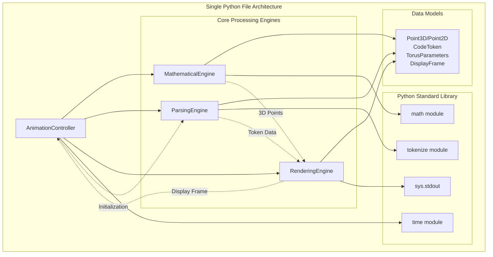

# Components

## MathematicalEngine

**Responsibility:** Generates 3D torus geometry, handles rotation transformations, and performs perspective projection calculations

**Key Interfaces:**
- `generate_torus_points(params: TorusParameters) -> List[Point3D]` - Creates surface points using parametric equations
- `apply_rotation(points: List[Point3D], angle: float) -> List[Point3D]` - Applies Y-axis rotation matrix
- `project_to_screen(point: Point3D) -> Point2D` - Perspective projection to 2D coordinates

**Dependencies:** Python math module for trigonometric functions, TorusParameters and Point3D/Point2D data models

**Technology Stack:** Pure Python with math.sin, math.cos, math.pi for parametric torus equations and rotation matrices

## ParsingEngine

**Responsibility:** Reads the script's own source code, tokenizes content, and classifies tokens by semantic importance

**Key Interfaces:**
- `read_self_code() -> str` - Uses `__file__` to read own source code
- `tokenize_code(source: str) -> List[CodeToken]` - Parses using Python tokenize module
- `classify_importance(token: CodeToken) -> ImportanceLevel` - Assigns semantic importance hierarchy

**Dependencies:** Python tokenize module, file I/O operations, CodeToken data model

**Technology Stack:** Python tokenize module for AST-level parsing, built-in file operations for self-reading

## RenderingEngine

**Responsibility:** Maps code tokens to torus surface coordinates, assigns ASCII characters based on importance, and manages depth-sorted display output

**Key Interfaces:**
- `map_tokens_to_surface(tokens: List[CodeToken], points: List[Point3D]) -> None` - Distributes tokens across torus
- `generate_ascii_frame(points: List[Point2D]) -> DisplayFrame` - Creates character buffer with depth sorting
- `output_to_terminal(frame: DisplayFrame) -> None` - Renders frame to stdout with screen clearing

**Dependencies:** CodeToken and Point3D/Point2D models, DisplayFrame buffer management, sys.stdout for terminal output

**Technology Stack:** Pure Python with sys.stdout, built-in sorting algorithms for depth management, print() with flush for terminal control

## AnimationController

**Responsibility:** Manages the main animation loop, controls frame timing, handles user interrupts, and coordinates between all other components

**Key Interfaces:**
- `run_animation_loop() -> None` - Main execution loop with frame rate control
- `calculate_frame_timing() -> float` - Maintains target 30+ FPS performance
- `handle_interrupts() -> bool` - Graceful Ctrl+C handling and cleanup

**Dependencies:** MathematicalEngine, ParsingEngine, RenderingEngine, time module for frame control

**Technology Stack:** Python time module for frame timing, signal handling for interrupts, component orchestration logic

## Component Diagrams

