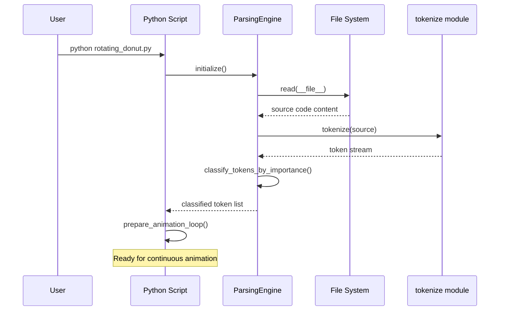
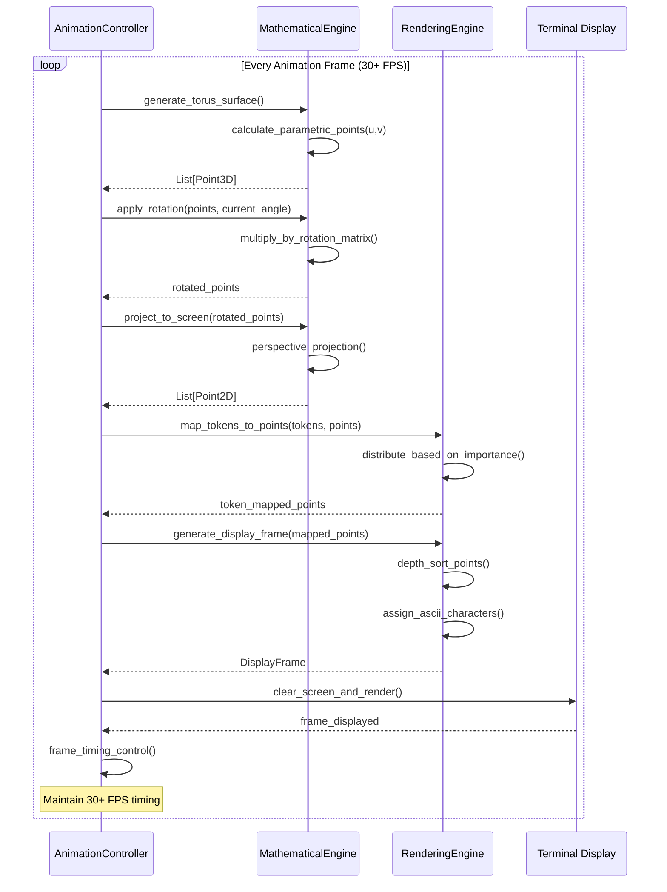
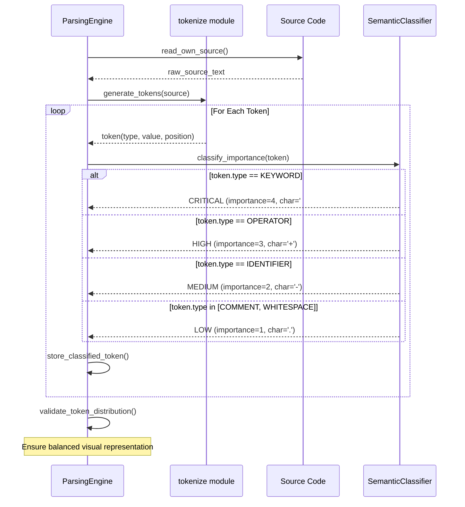
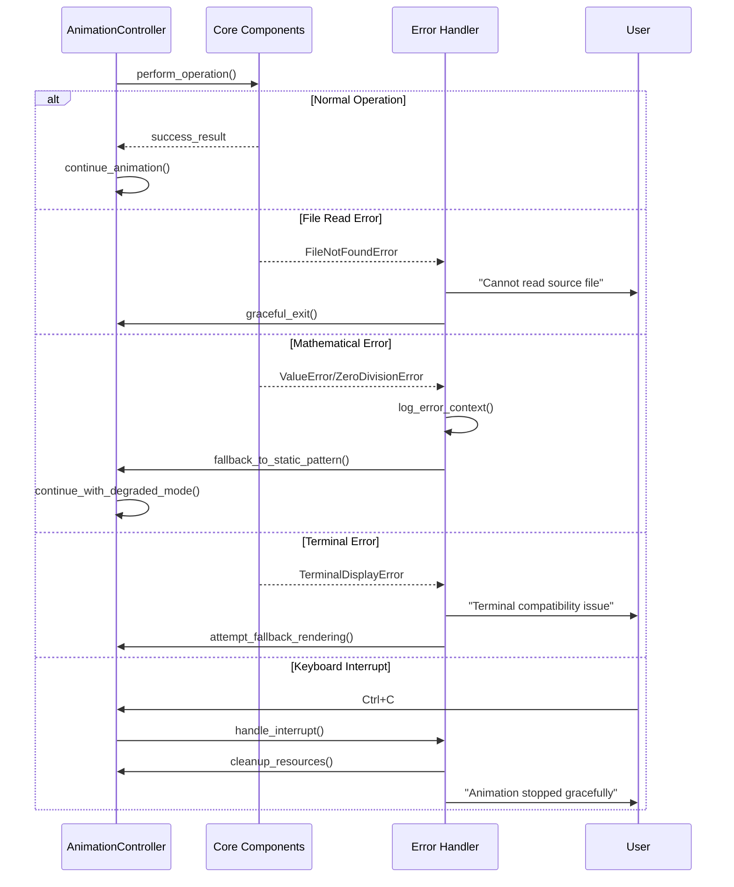

# Core Workflows

## Application Startup and Initialization

```mermaid
sequenceDiagram
    participant User as User
    participant Script as Python Script
    participant PE as ParsingEngine
    participant FS as File System
    participant Tokenizer as tokenize module

    User->>Script: python rotating_donut.py
    Script->>PE: initialize()
    PE->>FS: read(__file__)
    FS-->>PE: source code content
    PE->>Tokenizer: tokenize(source)
    Tokenizer-->>PE: token stream
    PE->>PE: classify_tokens_by_importance()
    PE-->>Script: classified token list
    Script->>Script: prepare_animation_loop()
    Note over Script: Ready for continuous animation
```

## Core Animation Frame Generation

```mermaid
sequenceDiagram
    participant AC as AnimationController
    participant ME as MathematicalEngine
    participant RE as RenderingEngine
    participant Terminal as Terminal Display

    loop Every Animation Frame (30+ FPS)
        AC->>ME: generate_torus_surface()
        ME->>ME: calculate_parametric_points(u,v)
        ME-->>AC: List[Point3D]

        AC->>ME: apply_rotation(points, current_angle)
        ME->>ME: multiply_by_rotation_matrix()
        ME-->>AC: rotated_points

        AC->>ME: project_to_screen(rotated_points)
        ME->>ME: perspective_projection()
        ME-->>AC: List[Point2D]

        AC->>RE: map_tokens_to_points(tokens, points)
        RE->>RE: distribute_based_on_importance()
        RE-->>AC: token_mapped_points

        AC->>RE: generate_display_frame(mapped_points)
        RE->>RE: depth_sort_points()
        RE->>RE: assign_ascii_characters()
        RE-->>AC: DisplayFrame

        AC->>Terminal: clear_screen_and_render()
        Terminal-->>AC: frame_displayed

        AC->>AC: frame_timing_control()
        Note over AC: Maintain 30+ FPS timing
    end
```

## Self-Referential Token Processing

```mermaid
sequenceDiagram
    participant PE as ParsingEngine
    participant Tokenizer as tokenize module
    participant Code as Source Code
    participant Classifier as SemanticClassifier

    PE->>Code: read_own_source()
    Code-->>PE: raw_source_text

    PE->>Tokenizer: generate_tokens(source)

    loop For Each Token
        Tokenizer-->>PE: token(type, value, position)
        PE->>Classifier: classify_importance(token)

        alt token.type == KEYWORD
            Classifier-->>PE: CRITICAL (importance=4, char='#')
        else token.type == OPERATOR
            Classifier-->>PE: HIGH (importance=3, char='+')
        else token.type == IDENTIFIER
            Classifier-->>PE: MEDIUM (importance=2, char='-')
        else token.type in [COMMENT, WHITESPACE]
            Classifier-->>PE: LOW (importance=1, char='.')
        end

        PE->>PE: store_classified_token()
    end

    PE->>PE: validate_token_distribution()
    Note over PE: Ensure balanced visual representation
```

## Error Handling and Recovery

```mermaid
sequenceDiagram
    participant AC as AnimationController
    participant Components as Core Components
    participant ErrorHandler as Error Handler
    participant User as User

    AC->>Components: perform_operation()

    alt Normal Operation
        Components-->>AC: success_result
        AC->>AC: continue_animation()
    else File Read Error
        Components-->>ErrorHandler: FileNotFoundError
        ErrorHandler->>User: "Cannot read source file"
        ErrorHandler->>AC: graceful_exit()
    else Mathematical Error
        Components-->>ErrorHandler: ValueError/ZeroDivisionError
        ErrorHandler->>ErrorHandler: log_error_context()
        ErrorHandler->>AC: fallback_to_static_pattern()
        AC->>AC: continue_with_degraded_mode()
    else Terminal Error
        Components-->>ErrorHandler: TerminalDisplayError
        ErrorHandler->>User: "Terminal compatibility issue"
        ErrorHandler->>AC: attempt_fallback_rendering()
    else Keyboard Interrupt
        User->>AC: Ctrl+C
        AC->>ErrorHandler: handle_interrupt()
        ErrorHandler->>AC: cleanup_resources()
        ErrorHandler->>User: "Animation stopped gracefully"
    end
```
