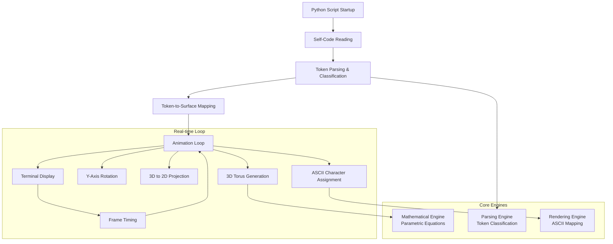

# High Level Architecture

## Technical Summary

The system implements a **monolithic, self-contained architecture** using pure Python with real-time mathematical computation, token-based parsing, and ASCII rendering. The core design centers around a continuous animation loop that performs 3D torus geometry calculations, self-referential source code analysis, and terminal-based visualization. Key components include the mathematical engine (parametric torus equations), the parsing engine (Python tokenization), the rendering engine (ASCII projection), and the animation controller (frame timing and rotation). This architecture directly supports the PRD goals of creating viral, educational content by maintaining simplicity, immediate execution, and cross-platform compatibility.

## High Level Overview

**Architectural Style:** Monolithic single-file application with real-time processing
**Repository Structure:** Single repository, single Python file (as specified in PRD)
**Service Architecture:** Monolith - all functionality contained within one executable script

**Primary Data Flow:**
1. **Initialization:** Script reads its own source code and parses tokens
2. **Preprocessing:** Tokens are classified and mapped to surface coordinates
3. **Animation Loop:** Continuous cycle of 3D rotation → projection → ASCII rendering → display
4. **Self-Reference:** The very code being executed drives its own visual representation

**Key Architectural Decisions:**
- **Single-file constraint** enables viral sharing and educational inspection
- **Zero external dependencies** ensures universal Python compatibility
- **Real-time processing** creates immediate visual impact without build steps
- **Self-referential design** creates unique artistic and technical showcase

## High Level Project Diagram

## Architectural and Design Patterns

**Core Architectural Patterns:**

- **Self-Referential Architecture:** The application analyzes and visualizes its own source code structure - _Rationale:_ Creates unique artistic concept and educational value while ensuring the visualization always reflects the current implementation

- **Real-Time Processing Pipeline:** Continuous data flow from mathematical computation through rendering to display - _Rationale:_ Supports the animation requirement and immediate visual impact needed for viral content

- **Functional Decomposition:** Clear separation between mathematical, parsing, and rendering concerns within single file - _Rationale:_ Maintains code clarity and educational value while respecting the single-file constraint

- **Stateless Frame Generation:** Each animation frame is computed independently from 3D coordinates - _Rationale:_ Simplifies animation logic and ensures consistent visual quality across all rotation angles

- **Token-Driven Rendering:** Visual output directly determined by source code semantic analysis - _Rationale:_ Creates the core innovative feature that transforms code structure into mathematical art
